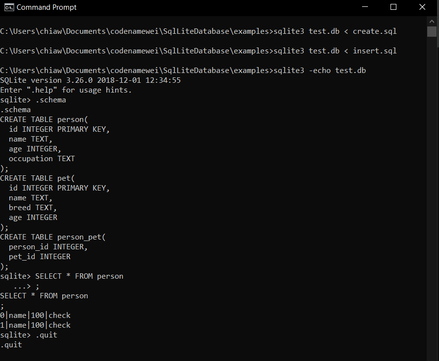

# Trainings on CRUD operations of SQLLite3

### How to create .db from .sql
- sqlite3 -echo test.db < test.sql

### SQLLite3 terminal commands 
Can be initiated after >>sqlite3 -echo test.db or >>sqlite3
- **.schema**: show the tables in the database
- **.quit**: exit sqlite3 terminal

### SQLLite3 keywords 
- **CREATE**: Create operation out of CRUD
- **INSERT INTO**: Put values into table  
- **DELETE**: Delete operation out of CRUD
- **SELECT**: Read operation out of CRUD  
- **DROP TABLE**: Delete an existing table
- **PRIMARY KEY**: A field in table that must contains of unique values

### FILES
- **create.sql**: Showcase CREATE operation
- **insert.sql**: Showcase INSERT INTO operation
- **select.sql**: Showcase SELECT operation
- **select_advanced.sql**: Showcase SELECT operation with more complex operations

###  Examples of running **create.sql** & **insert.sql**
In the command prompt
> sqlite3 test.db < create.sql  
> sqlite3 test.db < insert.sql  
> sqlite3 -echo test.db  

In the sqlite3 terminal  
> .schema  
> .quit  
  

###  Examples of running **select.sql** & **select_advanced.sql**  

From a continual of previous process
> sqlite3 test.db < select.sql   
> sqlite3 test.db < select_advanced.sql

